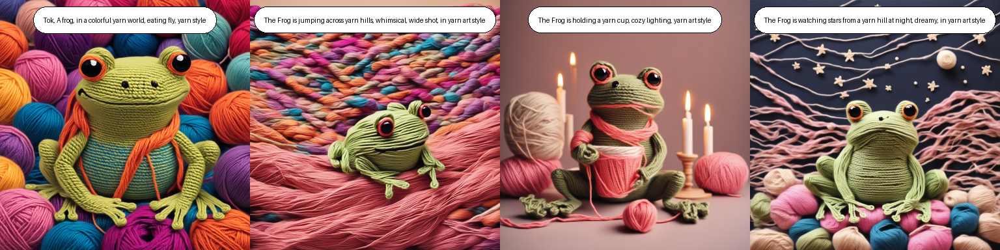

# 🧵 Comic Strip Generator with AI (SDXL + LoRA)

This project showcases a comic strip generation pipeline built on fine-tuned **Stable Diffusion XL (SDXL)**. The tool generates stylized, multi-panel comic narratives using custom LoRA adapters to ensure both artistic style and character consistency.

## 🚀 Project Overview

- AI-powered comic strip generator with 4-panel output
- Focused on:
  - 🎨 **Style Transfer** — Yarn Art style
  - 🐸 **Character Consistency** — Comic frog character across all panels
- Fine-tuned using **DreamBooth + LoRA** on SDXL for efficient, targeted training

## 🧠 Model Fine-Tuning Summary

### 1. Yarn Art Style Transfer
- Fine-tuned SDXL with a dataset of yarn-style illustrations
- Ensures all generated panels reflect a consistent handcrafted aesthetic

### 2. Comic Frog Character Consistency
- Separate LoRA fine-tuning with a class dataset of a custom frog character
- Maintains character continuity across multiple panels

## 🔧 Workflow (Current Implementation)

- **Input**: Hardcoded multi-prompt inputs (one per panel)
- **Process**:
  - Each prompt is passed to the fine-tuned SDXL model
  - LoRA adapters ensure visual consistency in both style and character
- **Output**: A cohesive 4-panel comic strip with stylized visuals

## Sample Output Images from Style transfer
- prompt = "a girl playing with a balloon, yarn art style"
- negative_prompt = "blurry, low quality, distorted, extra limbs, bad anatomy, deformed face, realistic face"

- prompt = "a mother playing with a toddler girl in the park,yarn art style"
- negative_prompt = "blurry, low quality, distorted, extra limbs, bad anatomy, deformed face, realistic face"

- prompt = "the cat is playing with a balloon,yarn art style"
  

- prompt = "a toddler girl went to zoo,sunny background with lots of trees.The girl is looking at a monkey. Monkey is inside the cage. Toddler girl is standing outside the cage, in yarn art style"
  

## Sample Output Frog Comic

## ✅ Features Implemented

- ✅ LoRA-based style transfer (yarn art aesthetic)
- ✅ Character preservation via DreamBooth tuning
- ✅ Multi-prompt support for 4-panel generation
- ✅ CLIP & BLIP score-based visual/text alignment evaluation
- ✅ Manual review for visual and narrative consistency
- ✅ Integrated DeepSeek R1 for automatic story-to-prompt generation
- ✅  Accept user input (text input) for dynamic comic creation
- ✅  Deployed App using Gradio 

## 👥 Use Case Scenarios

- 🧑‍🎨 Artists & Designers – Rapid comic prototyping
- 🧑‍🏫 Educators – Visual storytelling for learning materials
- 🧑‍💼 Marketers – Custom storytelling for campaigns
- 🧑‍💻 Hobbyists – Personal comic creation with unique styles

